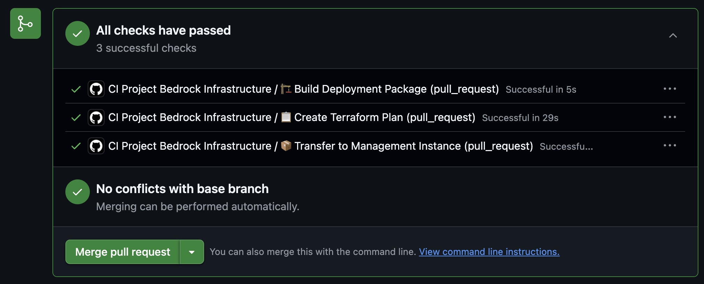
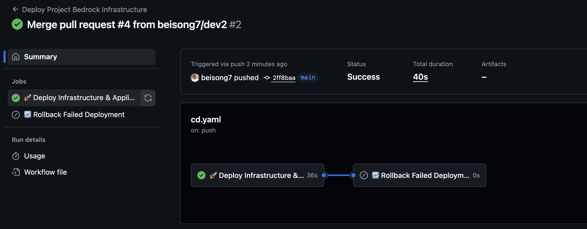

## Architecture Overview

The deployment of the application uses a branching strategy which allows the terraform to plan when a PR is done into the main branch. and when the merge is accepted the pipeline proceeds to apply the terraform.

The terraform creates the infrastructure for the application and the kubernetes provisions the application.

## Pre-Deployment

To deploy, you need create an EC2 instance to serve as a management instance. 

ensure the SSH Port is accessible, connect with ssh and install the following:
- AWS CLI
- kubectl
- Terraform
- Git

Also open IAM on aws and provision a user with the permissions for our EKS and autoscalling, vpc, ec2, etc. 

## Deployment

To deploy the application you need to provide the required keys to your github action secrets.

- The required keys are:
AWS_ACCESS_KEY_ID
    
    AWS_SECRET_ACCESS_KEY
    
    AWS_REGION
    
    EC2_HOST
    
    EC2_PRIVATE_KEY
    
    EC2_USER
    
### Branching Strategy
- Clone the repository and make a PR from another branch into main branch to review the Terraform Plan:

- While merging a PR into the main branch or making a push into main or completing any merge into main branch will deploy the application to the kubernetes cluster.

